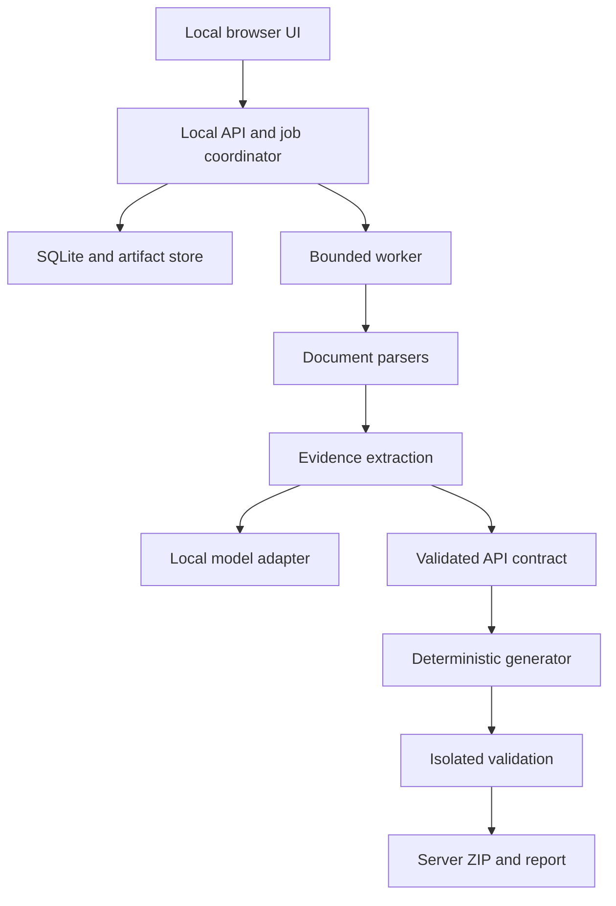

# Architecture

## System style
A local modular monolith with a separate bounded worker and a separately executable generated MCP runtime. React assets are served by the local backend in the packaged application. SQLite and artifact directories store state. Inference runs through a local-only adapter. No Redis, cloud queue, hosted database, or network vector service is required.

## Proposed implementation modules
| Module | Owns | Must not own |
|---|---|---|
| ingestion | MIME checks, normalization, source snapshots, text blocks | HTTP execution of document examples |
| extraction | Candidate endpoints, local retrieval, evidence, conflicts | Runtime secrets, code generation |
| contracts | Versioned typed data, semantic checks, capabilities | UI state or SDK implementation |
| planning | Tool packs, dependency closure, stable names | Permission bypass |
| generation | Templates, canonical output, package manifests | LLM requests or PDF parsing |
| runtime | HTTP adapter, policy, redaction, error mapping | Editing source documentation |
| validation | Sandbox lifecycle, protocol checks, mock suites | Production write access |
| evaluation | Fixed tasks, independent scoring, statistics | Altering test labels to improve results |
| storage | Transactions, content-addressed artifacts, migration | Credential plaintext storage |
| api/ui | Local interaction, review and export | Long-running inference in request handlers |

Suggested future repository directories: apps/api, apps/web, packages/core, packages/runtime, packages/templates, workers, tests/unit, tests/contract, tests/integration, tests/security, tests/offline, benchmarks, fixtures, docs, scripts. This is a layout proposal; the planning archive contains none of these implementation modules.

## Data flow and authority
Imported files become immutable SourceDocuments. Parsers create DocumentBlocks with source coordinates. Deterministic import or local extraction yields CandidateOperations, not executable tools. Semantic validation creates findings. Resolved candidates become immutable ApiContract revisions. ToolPlan references one contract revision and a policy revision. Generation uses only those frozen inputs. ValidationReport binds artifact hashes to actual executed checks.

Critical fields retain provenance through every transformation. Human overrides are a separate auditable layer, not changes to original documents. Re-extraction cannot silently erase reviewed corrections.

## Process boundaries
The local API binds loopback by default, checks Host/Origin, and uses a per-launch capability token for state-changing requests. The worker receives IDs and artifact references, never arbitrary shell scripts. The local model process receives bounded document excerpts with no credentials. The validation sandbox receives generated files, mock fixtures, and pinned dependencies, not the user's home directory or host environment.

Use SQLite-backed jobs with transactionally claimed leases. Default one inference job and one validation job, with configurable CPU-safe concurrency. Job states and recovery are specified in DATA_CONTRACTS.md. Persist checkpoint artifacts so extraction can resume after a crash without restarting every page.

## Network boundaries
Strict offline profile permits only registered loopback endpoints for API/UI, model inference, and local mocks. External document fetching is disabled. Local sandbox communication must not inadvertently grant internet access: colocate mock and server in an egress-denied test environment or use an explicitly isolated internal network.

Connected profile exposes explicit document-fetch and upstream-service allowances. It does not enable remote inference. Fetching an API's documentation and invoking its service are separate permissions. Generated runtime domain rules derive from reviewed configuration, not tool arguments.

## Generated runtime independence
A downloaded server must run without the DocForge UI, backend, database, or local model. Ship a pinned runtime dependency or vendored runtime source with compatible licensing and hashes. For disconnected installation, supply platform-specific dependency bundles separately from the lightweight server ZIP. Do not pretend an ordinary ZIP containing requirements alone is an offline installer.

Local stdio is the initial MCP transport. Remote Streamable HTTP is outside the flagship release. A separate trusted local approval utility can issue action approvals for exported servers; the agent-facing tool interface cannot approve itself.

## Change-aware regeneration
Compare normalized contracts, not only text diffs. Source version changes invalidate affected extraction checkpoints. Tool and policy changes invalidate approval tokens and relevant tests. Regeneration preserves overrides through stable operation identity; ambiguous matches become migration findings. All derived artifacts are immutable and refer back to source/contract/template versions.

## Scalability within a laptop
Keep document extraction streaming and bounded. Retrieve relevant evidence by headings, lexical search, and endpoint anchors before considering local embeddings. Use a model queue rather than loading several models at once. Page/filter large UI collections. Record peak memory and avoid a universal laptop-performance claim.
