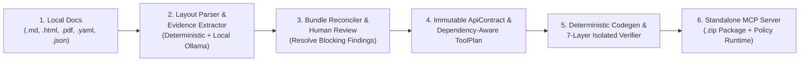

# Spigot (DocForge MCP) — Local Documentation-to-MCP Compiler

**Status: Flagship Release Complete (`P0`–`P8`, Tickets `T01`–`T32` verified; see [PROGRESS.md](PROGRESS.md) and [docs/release_evidence/RELEASE_EVIDENCE_REPORT.md](docs/release_evidence/RELEASE_EVIDENCE_REPORT.md)).**

Version 1.0 • 9 October 2026 • Dual project branding: **Spigot** / **DocForge MCP**.

## Product promise
Give **Spigot (DocForge MCP)** API documentation and receive an inspectable MCP server package, a source-backed API contract, and an honest validation report. Ordinary documentation is a first-class input, not a future feature. The system uses local inference for unstructured documentation and deterministic generation for executable behavior.

The flagship demonstration is: import a local PDF or Markdown API manual, extract operations with evidence, resolve one ambiguous field, generate a server, invoke it against a local mock, demonstrate a blocked unsafe action, and identify an integration-breaking change in a second version of the manual. Do all of this with external network access disabled.

---

## Key Use Cases

1. **Turn Unstructured Internal or Legacy API Docs into MCP Servers**
   - Many internal microservice runbooks, partner integrations, and legacy hardware/enterprise manuals only exist as **Markdown docs (`.md`)**, **saved HTML reference pages (`.html`)**, or **multi-page PDF manuals (`.pdf`)**—not clean OpenAPI specs. Spigot compiles those prose manuals (as well as OpenAPI 3.0 `.json`/`.yaml` specs) directly into runnable Python MCP servers.
2. **100% Offline & Air-Gapped Tool Generation**
   - Enterprise and security-sensitive teams cannot upload proprietary API documentation to cloud LLMs. Spigot runs **entirely on your machine** using local loopback Ollama models (`qwen2.5:1.5b` / `qwen2.5:0.5b`) and enforces a socket-level `STRICT_OFFLINE` guard so documentation and credentials never leave localhost.
3. **Fail-Closed Safety & Runtime Policy Enforcement for AI Agents**
   - Giving an AI agent raw access to production APIs is risky. Spigot compiles policies directly into the generated MCP runtime:
     - **`read_only` mode:** Blocks all `POST`/`PUT`/`PATCH`/`DELETE` calls at runtime.
     - **`approval_required` mode:** Requires a single-use, HMAC-SHA256 argument-bound approval token (tracked in a persistent SQLite nonce ledger) before executing state-changing or destructive tools.
     - **Host allowlisting & SSRF protection:** Rejects requests to unauthorized hosts and redacts secrets (`Authorization`, `X-API-Key`) from all logs and error envelopes.
4. **Context-Window Optimization via Dependency-Preserving Tool Packs**
   - Exposing dozens of verbose API endpoints bloats an agent's context window and degrades tool selection. Spigot slices an API contract into task-focused tool packs (e.g., *Read-Only Investigation* vs. *Operator CRUD*) while **automatically retaining prerequisite `{id}` lookup tools** (e.g., keeping `GET /customers` when `POST /orders` requires `customer_id`), reducing tool-schema context size by **`65.56%`** without breaking multi-step agent workflows.
5. **API Version Drift Detection & Safe Regeneration (`v1` → `v2`)**
   - When an upstream API manual updates, Spigot diffs the new contract against the previous revision, classifies **breaking vs. additive changes** (e.g., new required parameters, removed endpoints, auth header changes), carries forward valid human overrides, and invalidates stale ones before regenerating the server.

---

## How It Works (End-to-End Pipeline)

Spigot separates **probabilistic document understanding** from **deterministic code generation**. A language model never writes executable Python code; instead, it proposes structured facts that must pass verbatim quote verification against the source document before a deterministic compiler emits the MCP server.



### Stage-by-Stage Breakdown

#### Stage 1: Multi-Format Local Ingestion ([`packages/core/parsers/`](packages/core/parsers/))
- **OpenAPI 3.0 (`.json`, `.yaml`, `.yml`):** Normalized by [`normalize_openapi_document`](packages/core/openapi_normalizer.py) with bounded `$ref` resolution, cycle detection, and per-operation readiness scoring.
- **Markdown & Text (`.md`, `.txt`):** Parsed by [`parse_markdown_or_text`](packages/core/parsers/markdown_parser.py) with exact line-number and section-path provenance.
- **Saved HTML (`.html`, `.htm`):** Sanitized by [`sanitize_and_parse_saved_html`](packages/core/parsers/html_pdf_parser.py) (strips `<script>`, `<style>`, and event handlers; never fetches remote assets).
- **Text-Layer PDFs (`.pdf`):** Parsed by [`parse_pdf_document`](packages/core/parsers/html_pdf_parser.py) with page numbers and bounding-box coordinates. Scanned image-only PDFs fail closed with `OCR_REQUIRED` rather than hallucinating endpoints.

#### Stage 2: Evidence-Grounded Extraction ([`packages/core/extraction.py`](packages/core/extraction.py))
- Runs a 6-stage candidate extraction pipeline combining structural patterns (headings, HTTP verb+path lines, parameter tables, `curl` examples) with optional local Ollama structured JSON extraction ([`OllamaInferenceAdapter`](packages/core/local_inference.py)).
- **Anti-hallucination gate:** Every critical field (`HTTP method`, `path`, `base URL`, `auth scheme`, `parameter location/type`) must attach an [`EvidenceRef`](packages/core/contracts.py) containing an exact substring quote verified against the parsed source block. Unverified claims are downgraded to `UNVERIFIED_EVIDENCE` blocking findings.

#### Stage 3: Multi-Document Reconciliation & Review ([`packages/core/reconciliation.py`](packages/core/reconciliation.py))
- Merges multi-file bundles (for example, `01_auth_guide.md` + `02_endpoints_reference.pdf`) into a unified draft contract.
- Detects missing or contradictory facts across documents (`MISSING_METHOD`, `CONFLICTING_METHOD_PATH`, `AMBIGUOUS_AUTH`, `UNKNOWN_AUTH`, `MISSING_BASE_URL`).
- An operation cannot be promoted to `ready` until all blocking findings are resolved either by document evidence or an explicit, precondition-checked [`UserOverride`](packages/core/contracts.py) recorded by the project owner.

#### Stage 4: Dependency-Preserving Tool Planning & Deterministic Codegen ([`packages/core/planning.py`](packages/core/planning.py), [`packages/templates/generator.py`](packages/templates/generator.py))
- [`create_tool_plan`](packages/core/planning.py) selects operations for the chosen workflow preset, automatically pulls in prerequisite lookup tools when an operation requires a path/body `{id}`, and generates deterministic, agent-optimized tool descriptions.
- [`generate_server_package`](packages/templates/generator.py) emits a clean, inspectable Python MCP stdio server package where all URLs, schemas, and descriptions are serialized as pure JSON data structures (`json.dumps`), verified with `ast.parse`, and packaged into a byte-for-byte reproducible `.zip` archive.

#### Stage 5: Separated 7-Layer Verification ([`workers/validation_worker.py`](workers/validation_worker.py))
- [`IsolatedValidationWorker`](workers/validation_worker.py) validates the generated package across 7 independently reported gates:
  1. `build_status` (package structure & manifest integrity)
  2. `static_check_status` (AST & syntax safety)
  3. `protocol_check_status` (real MCP stdio JSON-RPC `initialize` & `tools/list` round-trip)
  4. `mock_test_status` (end-to-end tool calls against a local HTTP mock oracle)
  5. `security_suite_status` (prompt-injection, SSRF host blocking, secret redaction, and approval-gate tests)
  6. `sandbox_status` (uses rootless Docker/Podman `--network none` when installed; honestly reports `unavailable` when absent)
  7. `live_smoke_status` (optional connected smoke check)

#### Stage 6: Policy-Enforcing Runtime ([`packages/runtime/engine.py`](packages/runtime/engine.py))
- At runtime, [`ContractRuntimeEngine`](packages/runtime/engine.py) validates inputs against JSON Schema, enforces host allowlists and HTTP timeouts, retries safe `GET`/`HEAD`/`OPTIONS` calls on transient `429`/`503` errors, refuses automatic replay on ambiguous write timeouts (`OUTCOME_UNKNOWN`), enforces HMAC action approvals, and strips secrets from all outputs.

---

## What Documentation Works Best?

| Good Inputs (Supported) | What Spigot Needs Inside the Doc | Inputs That Fail Closed (By Design) |
|---|---|---|
| **OpenAPI 3.0** (`.json`, `.yaml`, `.yml`)<br/>**REST API Markdown/Text** (`.md`, `.txt`)<br/>**Saved HTML API Docs** (`.html`)<br/>**Text-Layer REST API PDFs** (`.pdf`)<br/>**Multi-File Bundles** (`auth.md` + `api.pdf`) | 1. **Base URL** (e.g., `https://api.example.com/v1`)<br/>2. **HTTP Verb + Path** (`GET /v1/users/{id}`)<br/>3. **Auth Scheme** (`Bearer`, `X-API-Key`, or `Public`)<br/>4. **Parameters / JSON Body fields**<br/>*(Any missing item can be supplied via Review Overrides)* | **Framework / Specification Metaschemas** (e.g., `microprofile-openapi-spec.pdf` documenting Java `@Operation` annotations)<br/>**Language SDK manuals** (e.g., Python/JS class docs with no HTTP methods/URLs)<br/>**Marketing / overview blog posts** with no concrete endpoints<br/>**Scanned image-only PDFs** (`OCR_REQUIRED`) |

### Ready-to-Try Sample Files in [`examples/`](examples/README.md)
You can upload any of these files in the Web Studio—or click the **1-Click Sample API Docs** buttons right inside Step 1 of `http://127.0.0.1:8000`:
- **3-Page Typeset PDF Manual:** [`examples/01_payments_api_manual.pdf`](examples/01_payments_api_manual.pdf) (*StripeFlow Payments & Treasury API v2.4* — 7 endpoints across Customers, Charges, and Refunds)
- **Markdown REST API Manual:** [`examples/02_support_tickets_api.md`](examples/02_support_tickets_api.md) (*HelpDesk Cloud SLA Triage API v2.1* — 7 endpoints across Customers, Tickets, and Comments)
- **Styled Developer Portal HTML:** [`examples/03_incident_response_api.html`](examples/03_incident_response_api.html) (*OpsGuard Incident & On-Call API* — 5 endpoints)
- **OpenAPI 3.0.3 YAML Spec:** [`examples/04_inventory_openapi_3_0.yaml`](examples/04_inventory_openapi_3_0.yaml) (*Global Warehouse & Order Fulfillment API* — 6 endpoints with `$ref` schemas)
- **Flagship Blocker-Resolution Demo:** [`examples/05_flagship_review_demo.md`](examples/05_flagship_review_demo.md) (*FleetCloud Kubernetes Orchestrator API* — 4 clean endpoints + 1 intentional `MISSING_METHOD` blocker on `/v1/clusters/{cluster_id}/drain` to test 1-click Step 3 override resolution)

---

## Quickstart & How to Use

### Option A: Interactive Local Web Studio (`http://127.0.0.1:8000`)
Launch the local single-owner studio server ([`apps/api/server.py`](apps/api/server.py) + [`apps/web/index.html`](apps/web/index.html)):
```powershell
.\.venv\Scripts\uvicorn.exe apps.api.server:create_local_app --factory --host 127.0.0.1 --port 8000
```
Open **`http://127.0.0.1:8000`** in your browser to walk through the 5-step studio workflow:
1. **Import Documentation Bundle (or 1-Click Sample):** Click any of the **1-Click Sample API Docs** buttons (`PDF`, `Markdown`, `HTML`, `OpenAPI 3.0`) or upload your own files from [`examples/`](examples/README.md).
2. **Inspect Evidence:** Review extracted endpoints alongside exact source quotes and page/line numbers.
3. **Review & Resolve:** Supply audited owner overrides for any missing/ambiguous fields and freeze the contract.
4. **Tool Pack & Policy:** Select a dependency-preserving tool pack and runtime policy (`read_only`, `restricted_write`, `approval_required`).
5. **Validate & Export:** Run the 7-layer verifier and download the standalone MCP server `.zip`.

### Option B: Python Pipeline CLI
Compile any local documentation file or bundle directly from Python via [`compile_documentation_bundle`](packages/core/pipeline.py):
```powershell
.\.venv\Scripts\python.exe -c "
from pathlib import Path
from packages.core.pipeline import RawDocumentInput, compile_documentation_bundle
from packages.core.planning import RuntimePolicy

doc_path = Path('fixtures/p0_support_tickets/support_api_v1.md')
result = compile_documentation_bundle(
    [RawDocumentInput('src_1', doc_path.name, doc_path.read_bytes())],
    contract_id='support_api_v1',
    project_id='demo_project',
    policy=RuntimePolicy(allowed_hosts=['api.support.internal']),
    use_local_model=True,
    output_dir=Path('build/support_mcp_server'),
    zip_path=Path('build/support_mcp_server.zip'),
)
print('Exported MCP server with', len(result.contract.operations), 'operations!')
"
```

### Option C: Standardized Verification & Benchmark Commands (`packages.core.release_evidence`)
After dependencies are installed in `.venv` (`Python 3.13.14`, `uv 0.12.11`), run any standardized target from [IMPLEMENTATION.md](IMPLEMENTATION.md):

```powershell
# Lint & static checks
.\.venv\Scripts\python.exe -m packages.core.release_evidence check

# Unit, contract, integration, security, and offline test suites
.\.venv\Scripts\python.exe -m packages.core.release_evidence test-unit
.\.venv\Scripts\python.exe -m packages.core.release_evidence test-contract
.\.venv\Scripts\python.exe -m packages.core.release_evidence test-integration
.\.venv\Scripts\python.exe -m packages.core.release_evidence test-security
.\.venv\Scripts\python.exe -m packages.core.release_evidence test-offline

# Extraction & paired agent evaluation benchmarks
.\.venv\Scripts\python.exe -m packages.core.release_evidence eval-extraction
.\.venv\Scripts\python.exe -m packages.core.release_evidence eval-agent

# Full 9-step flagship offline rehearsal & release evidence bundle generation
.\.venv\Scripts\python.exe -m packages.core.release_evidence release-verify
```

### Run the full 43-test suite directly
```powershell
.\.venv\Scripts\ruff.exe check .
.\.venv\Scripts\pytest.exe -v
```

## Architecture & supported-feature summary
- **Multi-format local ingestion (`FR-01`–`FR-04`):** OpenAPI 3.0 JSON/YAML normalizer ([packages/core/openapi_normalizer.py](packages/core/openapi_normalizer.py)), line-accurate Markdown/text parser ([packages/core/parsers/markdown_parser.py](packages/core/parsers/markdown_parser.py)), sanitized saved HTML parser, and multi-page text PDF parser with page/bbox citations and scanned-page detection (`OCR_REQUIRED`, [packages/core/parsers/html_pdf_parser.py](packages/core/parsers/html_pdf_parser.py)).
- **Evidence-grounded extraction & reconciliation (`FR-05`–`FR-06`):** Local loopback-only `OllamaInferenceAdapter` ([packages/core/local_inference.py](packages/core/local_inference.py)), 6-stage candidate extraction with verbatim quote verification ([packages/core/extraction.py](packages/core/extraction.py)), multi-document bundle reconciliation, conflict/ambiguity blocking (`MISSING_METHOD`, `CONFLICTING_METHOD_PATH`, `AMBIGUOUS_AUTH`, `UNKNOWN_AUTH`), and precondition-checked `UserOverride` records ([packages/core/reconciliation.py](packages/core/reconciliation.py)).
- **Dependency-preserving tool packs & deterministic codegen (`FR-07`–`FR-08`, `FR-13`):** Automatic `{id}` prerequisite lookup inference (`suggest_tool_pack`, `resolve_tool_pack_dependencies`, [packages/core/planning.py](packages/core/planning.py)), AST-validated code generation (`ast.parse`), and byte-for-byte reproducible `.zip` exports ([packages/templates/generator.py](packages/templates/generator.py)).
- **Resilient, policy-enforcing MCP stdio runtime (`FR-09`–`FR-10`, `FR-15`):** Standalone `ContractRuntimeEngine` ([packages/runtime/engine.py](packages/runtime/engine.py)) enforcing `read_only`, `restricted_write`, and `approval_required` policies, HMAC-SHA256 argument-bound single-use action approvals backed by a persistent SQLite consumed-nonce ledger ([packages/core/approval.py](packages/core/approval.py)), safe read retries, `OUTCOME_UNKNOWN` non-replay on ambiguous write failures, secret-safe circuit breakers, and automatic credential redaction.
- **Separated validation layers & semantic evolution (`FR-11`–`FR-12`, `FR-14`):** `IsolatedValidationWorker` ([workers/validation_worker.py](workers/validation_worker.py)) reporting distinct `build_status`, `static_check_status`, `protocol_check_status`, `mock_test_status`, `security_suite_status`, `sandbox_status`, and `live_smoke_status`; semantic contract diffing and safe regeneration ([packages/core/evolution.py](packages/core/evolution.py)).

## Measured benchmark & evaluation summary (`T32`)
All metrics below are computed strictly from raw evaluation rows in [docs/release_evidence/RELEASE_EVIDENCE_REPORT.md](docs/release_evidence/RELEASE_EVIDENCE_REPORT.md), [docs/release_evidence/extraction_evaluation.json](docs/release_evidence/extraction_evaluation.json), and [docs/release_evidence/agent_evaluation_raw_rows.csv](docs/release_evidence/agent_evaluation_raw_rows.csv) on `Windows 11 (AMD64)`, `Python 3.13.14`:

- **Held-out extraction (`8` variants, including unseen `appointments` Clinic Scheduling API family):**
  - Endpoint Precision: `13/13` (`100.0%`)
  - Endpoint Recall: `13/13` (`100.0%`)
  - Critical-Field Exact Accuracy: `65/65` (`100.0%` across `method`, `relative_path`, `auth_status`, `parameters`, `request_body`)
  - Unsupported Assertion Rate: `0/26` (`0.0%`)
  - Evidence Validity Rate: `30/30` (`100.0%`)
  - Correct Abstention Rate: `2/2` (`100.0%`)
- **Full corpus extraction (`20` variants across `dev` + `held_out`):**
  - Endpoint Precision & Recall: `31/31` (`100.0%`), Critical-Field Exact Accuracy: `155/155` (`100.0%`), Correct Abstention Rate: `5/5` (`100.0%`).
- **Paired held-out agent evaluation (`6` executable tasks + `1` policy-refusal task):**
  - `Condition A (All tools, original prose)`: `6/6` (`100.0%`) normal task success, `1/1` (`100.0%`) refusal accuracy, avg `4.14` advertised tools (`1835.0` context chars).
  - `Condition B (Naive manual subset, original prose)`: `4/6` (`66.7%`) normal task success (`2` multi-step tasks failed due to pruned prerequisite `{id}` lookup tools), `1/1` (`100.0%`) refusal accuracy.
  - `Condition C (Spigot dependency-preserving tool pack, rewritten descriptions)`: `6/6` (`100.0%`) normal task success, `1/1` (`100.0%`) refusal accuracy, avg `1.71` advertised tools (`631.9` context chars — **`65.56%` tool-schema context reduction** vs. `Condition A`).

## Security boundaries & honest limitations
- **Strict offline guarantee:** `NetworkPolicyGuard(profile=NetworkProfile.STRICT_OFFLINE)` blocks all non-loopback socket connections. Cloud model IDs are rejected by policy (`LocalModelPolicyError`).
- **Untrusted documentation & model output:** Document text and model outputs are never interpolated into executable Python syntax or shell commands. Embedded cURL examples are never executed.
- **Container sandbox honesty:** `IsolatedValidationWorker` automatically uses hardened rootless Docker/Podman (`--network none --read-only --cap-drop ALL`) when available on the host, and fails closed (`sandbox_status="unavailable"`, `can_claim_isolated_execution=False`) when container runtime tooling is absent.
- **Explicit non-goals & deferred extensions:** Scanned image-only PDFs fail closed with `OCR_REQUIRED` (no silent cloud OCR). OAuth interactive flows, GraphQL, SOAP, gRPC, WebSockets, and non-JSON multipart streaming are explicitly marked unsupported (`COMPATIBILITY.md`).

## Binding user constraints
- Plan only at the time this archive is delivered. Reading this archive is not authorization to implement it.
- Once the owner explicitly requests implementation, follow [AGENTS.md](AGENTS.md) and [IMPLEMENTATION.md](IMPLEMENTATION.md).
- No required OpenAI, Anthropic, Gemini, or other cloud AI API credentials in the product. A coding assistant used to build the project is separate from the application's runtime dependencies.
- Core processing, local inference, generation, local testing, and reports work offline after prerequisites are installed.
- Slack, GitHub, and similar service credentials are permitted for optional connected integration tests and runtime calls. Those services require network access.
- Local processes on the laptop are allowed. No hosted backend, cloud database, Kubernetes cluster, or always-on remote system is required.
- No dataset hunting or model training. Build deterministic synthetic documentation and fixtures; optionally evaluate public documentation snapshots with licenses recorded.
- A model and dependencies must be acquired before disconnected use. Do not claim a fresh machine can run offline without them.

## Read order
1. [AGENTS.md](AGENTS.md): execution rules and handoff discipline.
2. [PRODUCT_REQUIREMENTS.md](PRODUCT_REQUIREMENTS.md): scope, acceptance criteria, and non-goals.
3. [ARCHITECTURE.md](ARCHITECTURE.md): components and trust boundaries.
4. [DATA_CONTRACTS.md](DATA_CONTRACTS.md): shared representation and lifecycle.
5. [IMPLEMENTATION.md](IMPLEMENTATION.md): sequenced build gates.
6. Read the specialist documents relevant to the current milestone.

## Document index
| File | Purpose |
|---|---|
| AGENTS.md | Rules for the implementation agent |
| IMPLEMENTATION.md | Milestones, dependencies, exit gates, verification commands |
| ARCHITECTURE.md | Local system, module boundaries, execution paths |
| PRODUCT_REQUIREMENTS.md | Traceable functional and quality requirements (`FR-01`–`FR-17`) |
| DOCUMENT_UNDERSTANDING.md | Parsing, extraction, provenance, conflict resolution |
| DATA_CONTRACTS.md | API contract, evidence, persistence, revisions |
| COMPATIBILITY.md | Explicit input, schema, authentication and transport boundaries |
| LOCAL_AI.md | Local model interface, prompts, hardware qualification |
| GENERATOR_RUNTIME.md | Server output, HTTP behavior, policies, packaging |
| SECURITY.md | Threat model, controls, approvals, security tests |
| API_UI_SPEC.md | Local API contracts and review experience |
| TESTING_EVALUATION.md | Independent oracles, benchmarks, release gates |
| OFFLINE_OPERATIONS.md | Installation, network profiles, backup, recovery |
| BACKLOG.md | Ordered implementation tickets and dependencies (`T01`–`T32`) |
| DECISIONS_RISKS.md | Architecture decisions and unresolved choices |
| PORTFOLIO_DEMO.md | Demonstration and evidence-based resume positioning |
| BUILD_AGENT_PROMPT.md | Paste-ready instructions for a coding agent |
| PROGRESS.md | Implementation handoff record (`P0`–`P8`) |
| SOURCES.md | Primary references and verification policy |
| docs/release_evidence/RELEASE_EVIDENCE_REPORT.md | Committed flagship rehearsal, traceability matrix, and raw metrics |
