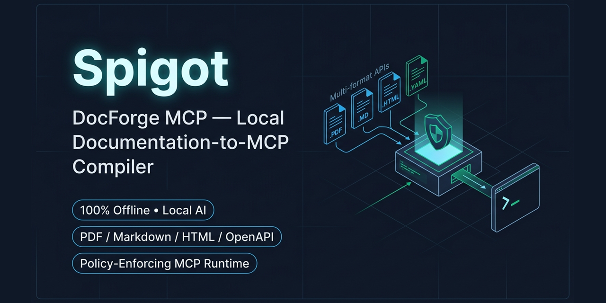
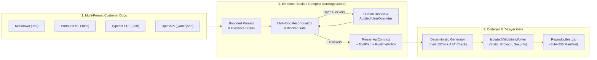
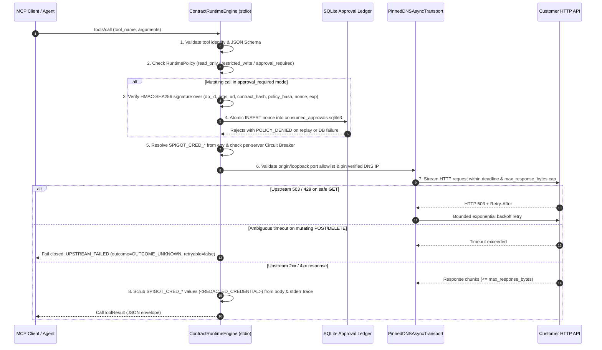

# Spigot (DocForge MCP)

<p align="center">
  
</p>

<p align="center">
  <a href="https://github.com/Abhishek-Gali/Spigot/actions"></a>
  
  
  
  
</p>

**Spigot (DocForge MCP)** is a local-first integration compiler and policy-enforcing runtime that turns messy, multi-format API documentation (`.md`, `.html`, `.pdf`, `.yaml`/`.json`) into audited, standalone **Model Context Protocol (MCP)** servers.

---

## 1. The Problem & Why Spigot Exists (2-Minute Overview)

When Forward Deployed Engineers (FDEs) and integration engineers connect an AI agent to a customer's internal services, the customer rarely hands over a clean, validated OpenAPI 3.1 specification. Instead, documentation arrives as a mix of **Markdown runbooks, developer portal HTML exports, typeset PDF manuals, and partial OpenAPI files**.

Connecting agents to these services in real deployments fails in four predictable ways:

1. **Missing or conflicting endpoint specs cause silent hallucinations:** A prose runbook omits the HTTP verb on a maintenance endpoint or disagrees with an older spec on a URL path. Prompt-based wrappers guess the missing fields. **Spigot fails closed**, raising typed blocker findings (`MISSING_METHOD`, `UNKNOWN_AUTH`, `CONFLICTING_PATH`) tied to exact character offsets (`EvidenceRef`) and requiring an audited human override before compilation can proceed.
2. **Unguarded write operations create operational risk:** Exposing `POST`, `PUT`, or `DELETE` endpoints directly to an agent risks unauthorized state mutations or replayed approvals. **Spigot enforces policy inside the generated runtime** (`read_only`, `restricted_write`, or `approval_required` with two-step human confirmation, HMAC-SHA256 action binding, and a persistent SQLite single-use nonce ledger).
3. **Unfiltered API surfaces bloat agent context:** Dumping 50–100 raw endpoints into an MCP server degrades tool selection and wastes tokens. **Spigot compiles task-scoped `ToolPlan`s** that prune unrelated operations while preserving prerequisite lookup dependencies (reducing advertised schema tokens from **1,001 to 410** on our benchmark corpus).
4. **Upstream API updates silently break integrations:** When a customer adds a required parameter in `v2`, existing agent tools fail at runtime with opaque errors. **Spigot computes a normalized semantic diff (`ContractDiffReport`)**, flags breaking changes against affected MCP tools, invalidates stale approvals, and carries forward still-valid human overrides.

---

## 2. System Architecture

### A. Compile-Time Pipeline (Documentation $\rightarrow$ Verified `.zip` Package)



### B. Runtime Execution, Approval & Failure-Handling Flow (`packages/runtime/engine.py`)

Every exported `.zip` package contains a self-contained runtime (`ContractRuntimeEngine`) that executes tool calls without requiring the Spigot backend or a local LLM:



---

## 3. Quickstart & Verified Commands

### Prerequisites
- **Python:** `>=3.12, <3.14` (tested on Python 3.12 and 3.13 across Windows and Ubuntu Linux)
- **Package Manager:** [`uv`](https://docs.astral.sh/uv/) (recommended) or standard `venv` + `pip`
- **No GPU, Docker, or external API keys required** for the deterministic compiler, Web Studio, 55-test suite, or FDE integration demo.

### Installation

```bash
git clone https://github.com/Abhishek-Gali/Spigot.git
cd Spigot

# Install exact locked dependencies from uv.lock
uv sync --locked
```

### Run the 1-Command End-to-End FDE Integration Demo (~3 seconds)

To verify the entire system in one command—including messy doc ingestion, blocker resolution, `.zip` export, standalone MCP tool execution, two-step write approval, SQLite replay rejection, 5 operational failure modes (`401` redaction, `503` retry, write timeout `OUTCOME_UNKNOWN`, oversized stream cutoff, circuit breaker), and `v1 -> v2` drift detection:

```bash
# Cross-platform via uv:
uv run python scripts/run_fde_demo.py

# Or directly via the virtual environment:
# Windows PowerShell: .\.venv\Scripts\python.exe scripts/run_fde_demo.py
# Linux / macOS:      ./.venv/bin/python scripts/run_fde_demo.py
```

### Launch the Local Web Studio

```bash
# Cross-platform via uv:
uv run uvicorn apps.api.server:create_local_app --factory --host 127.0.0.1 --port 8000

# Windows PowerShell without uv:
.\.venv\Scripts\uvicorn.exe apps.api.server:create_local_app --factory --host 127.0.0.1 --port 8000
```

Open **`http://127.0.0.1:8000`** in your browser. Click **`⚡ Run 1-Click Flagship Demo`** in the header—or pick any of the 5 sample customer docs in **Step 1**—to walk through all 6 steps interactively.

### Run Linter & Full 55-Test Suite

```bash
uv run ruff check .
uv run pytest -v
```

### Environment Variables Reference

| Variable | Scope | Purpose | Default |
|---|---|---|---|
| `SPIGOT_WORKSPACE_DIR` | Compiler API | Local workspace directory for SQLite metadata, content-addressed blobs, and provisioned keys | `.spigot/workspace` |
| `SPIGOT_CAPABILITY_TOKEN` | Compiler API | Single-owner capability token required in `X-Spigot-Token` header for state-changing API calls | Auto-generated per session |
| `SPIGOT_APPROVAL_SECRET` | Compiler API & Runtime | Shared HMAC-SHA256 secret ($\ge 16$ chars) for signing/verifying single-use write approval tokens | Auto-provisioned in `approval_authority.key` |
| `SPIGOT_APPROVAL_SECRET_FILE` | Generated Runtime | Path to the workspace `approval_authority.key` file so standalone extracted `.zip` servers verify API-issued tokens | `.spigot/workspace/approval_authority.key` |
| `SPIGOT_APPROVAL_LEDGER_PATH` | Generated Runtime | Persistent SQLite ledger storing consumed approval nonces across restarts | `<secret_dir>/consumed_approvals.sqlite3` |
| `SPIGOT_ACTION_APPROVAL_TOKEN` | Generated Runtime | Single-use JSON approval token string passed for a mutating tool invocation in `approval_required` mode | Unset (fail-closed) |
| `SPIGOT_CRED_<SCHEME_ID>` | Generated Runtime | Runtime upstream API credential (e.g., `SPIGOT_CRED_BEARER_AUTH`); never stored in contracts or prompts | Unset (fail-closed) |
| `SPIGOT_SERVER_URL_<SERVER_ID>` | Generated Runtime | Optional runtime override for a contract server's base URL (still checked against `allowed_origins` policy) | Contract `base_url` |

---

## 4. Demonstrable End-to-End Use Case (`scripts/run_fde_demo.py`)

Below is the exact scenario executed by [`scripts/run_fde_demo.py`](scripts/run_fde_demo.py) using the sample customer runbook [`examples/05_flagship_review_demo.md`](examples/05_flagship_review_demo.md) (**FleetCloud Kubernetes & Node Orchestrator API**):

### Step 1: Ingest Messy Customer Documentation & Catch Blocker Findings
The customer's Markdown manual documents 5 endpoints, but section 4 (`Drain Cluster Nodes`) omits the HTTP method (`Endpoint path: /v1/clusters/{cluster_id}/drain`). Spigot refuses to guess:

```text
==============================================================================
STEP 1: Ingest Customer API Manual, Catch Blocker, Apply Audited Override
==============================================================================
[+] Imported '05_flagship_review_demo.md' into project 'proj_7303f4902e5d'
[+] Open Blocker Findings: 2 (revision=1)
    - BLOCKER [MISSING_METHOD] on operation 'op_v1_clusters_cluster_id_drain': Endpoint '/v1/clusters/{cluster_id}/drain' in section 'Drain Cluster Nodes (Ambiguous Method Demo)' does not specify an HTTP method (GET, POST, PUT, PATCH, DELETE).
    - BLOCKER [UNKNOWN_SEMANTIC_EFFECT] on operation 'op_v1_clusters_cluster_id_drain': Semantic effect for 'op_v1_clusters_cluster_id_drain' is unknown (disabled by default).
[+] Applied audited UserOverride on 'op_v1_clusters_cluster_id_drain' -> revision=2, open_blockers=0
[+] Frozen Immutable Contract (SHA-256: e5868d714bc53cfb...)
[+] 7-Layer Validation Gate: job_status='SUCCEEDED', build='passed', static='passed', protocol='passed', security='passed', sandbox='unavailable'
```

### Step 2: Standalone Extracted `.zip` Execution & Read-Only Policy Enforcement
The exported `.zip` is unpacked into an isolated directory, verified against `manifest.json` SHA-256 hashes, and executed against a live local FleetCloud HTTP service:

```text
==============================================================================
STEP 2: Standalone Extracted .zip Execution & Read-Only Policy Enforcement
==============================================================================
[+] Exported ZIP Manifest Integrity Check: verified=True (12 files SHA-256 verified)
[+] Loaded standalone MCP runtime from extracted ZIP (2 tools):
    - get_v1_clusters
    - get_v1_clusters_cluster_id
[+] Live GET /v1/clusters -> HTTP 200, clusters=1
[+] Attempted write in 'read_only' mode -> isError=True, code=POLICY_DENIED: Mutating operation 'post_v1_clusters' (write) is denied in read_only policy mode.
```

### Step 3: Two-Step Human-Confirmed Approval & SQLite Replay Prevention
When upgraded to `approval_required` mode, mutating calls (`post_v1_clusters`) require:
1. `POST /api/projects/{id}/approvals/prepare` to compute the canonical `action_digest`.
2. `POST /api/projects/{id}/approvals/issue` with explicit `human_confirmed=True` (omitting `human_confirmed` defaults to `False` and is rejected with `HTTP 403 POLICY_DENIED`).
3. Single-use execution: replaying the same token—even in a newly spawned process—is rejected by `consumed_approvals.sqlite3`:

```text
==============================================================================
STEP 3: Two-Step Human Approval & Persistent SQLite Replay Prevention
==============================================================================
[+] Step 3a (/approvals/prepare): Computed canonical action_digest=2994b385df61adf7...
[+] Step 3b (Unconfirmed /approvals/issue): Properly rejected with HTTP 403 (POLICY_DENIED)
[+] Step 3c (Confirmed Write Execution): HTTP 201 -> created cluster 'cls_prod_02' (prod-eu-west-1)
[+] Step 3d (Token Replay Attempt across new process/engine): isError=True, reason='Action approval token has already been consumed in ledger (replay denied).'
```

### Step 4: Operational Failure Handling & Recovery Verification
Real customer APIs fail with expired tokens, rate limits, 503s, hung sockets, and oversized payloads. The runtime handles each deterministically:

```text
==============================================================================
STEP 4: Operational Failure Handling & Recovery Verification
==============================================================================
[+] 4A (401 Unauthorized + Secret Redaction): isError=True, payload={"attempts": 1, "data": {"detail": "Rejected credential header: Bearer <REDACTED_CREDENTIAL>", "error": "unauthorized"}, "operation_id": "get_v1_clusters", "status_code": 401}
[+] 4B (Transient 503 on Safe GET): Recovered on attempt 3 -> HTTP 200
[+] 4C (Ambiguous Write Timeout): code=UPSTREAM_FAILED, retryable=False, attempts=1, outcome=OUTCOME_UNKNOWN
[+] 4D (Oversized Upstream Stream): stage=response_bounds, message='Response from 'get_v1_clusters' (4110 bytes) exceeded max_response_bytes budget (4096 bytes).'
[+] 4E (Circuit Breaker Tripped): stage=circuit_breaker, message='Circuit breaker is OPEN for server 'default' (cooldown remaining: 29.998s).'
```

### Step 5: Contract `v1 -> v2` Breaking Drift Detection
When the customer updates the documentation in `v2` to add a required `cost_center` body field to `POST /v1/clusters`, Spigot flags the breaking change while automatically carrying forward the still-valid human override on `/v1/clusters/{cluster_id}/drain`:

```text
==============================================================================
STEP 5: Contract v1 -> v2 Breaking Drift Detection
==============================================================================
[+] Regenerated v2 against v1: has_breaking_changes=True, breaking_count=1, carried_overrides=1
    - BREAKING [request_body_modified] on 'post_v1_clusters': Request body schema or requirement changed on 'post_v1_clusters'.
```

---

## 5. Engineering Decisions, Security Controls & Honest Limitations

### Key Engineering Decisions

| Control Area | Implementation Detail | Source Location |
|---|---|---|
| **No Model-Generated Code Execution** | Templates never call models. Generated packages contain only AST-verified static Python modules plus inert JSON files (`contract.json`, `tool_plan.json`, `policy.json`). | [`packages/templates/generator.py`](packages/templates/generator.py) |
| **Loopback Port Allowlisting & SSRF Prevention** | `STRICT_OFFLINE` blocks all non-loopback traffic and restricts `127.0.0.1`/`localhost` connections to explicitly allowlisted ports (default `{11434}` for Ollama; blocks local services like Redis `6379`). | [`packages/core/network_guard.py`](packages/core/network_guard.py), [`packages/runtime/engine.py`](packages/runtime/engine.py) |
| **DNS-Rebinding TOCTOU Defense** | `PinnedDNSAsyncTransport` resolves DNS once during policy validation, blocks private/loopback/link-local IPs for external hosts, and connects directly to the verified IP while preserving the `Host` header and TLS `sni_hostname`. | [`packages/runtime/engine.py`](packages/runtime/engine.py) |
| **Two-Step Human Approval & SQLite Replay Ledger** | `/approvals/issue` requires a prior `/approvals/prepare` call and explicit `human_confirmed=True`. Tokens are bound via HMAC-SHA256 to `(operation_id, arguments, target_url, contract_hash, policy_hash, nonce, expires_at)` and recorded in `consumed_approvals.sqlite3`. | [`packages/core/approval.py`](packages/core/approval.py), [`apps/api/server.py`](apps/api/server.py) |
| **Parser-Level Streaming Upload Bounds** | `BoundedMultiPartParser` enforces per-file (`10 MiB`), aggregate request (`20 MiB`), file-count (`20`), and field-count (`20`) caps during chunked multipart parsing before temporary files can exhaust disk or RAM. | [`apps/api/server.py`](apps/api/server.py) |
| **Streaming Response Cap & Ambiguous Write Safety** | Upstream responses are read via `client.stream()` and aborted mid-stream if received bytes exceed `max_response_bytes`. Read operations retry transient `429`/`502`/`503`/`504` with backoff; mutating operations without an idempotency key never auto-retry and return `OUTCOME_UNKNOWN` (`retryable=False`) on timeout. | [`packages/runtime/engine.py`](packages/runtime/engine.py) |
| **ZIP Manifest Verification** | `export_reproducible_zip` and `IsolatedValidationWorker` verify every file in the package directory and `.zip` archive against `manifest.json` SHA-256 digests and reject any unmanifested file. | [`packages/templates/generator.py`](packages/templates/generator.py), [`workers/validation_worker.py`](workers/validation_worker.py) |

### What the 55 Automated Tests Verify

The test suite (`uv run pytest -v`, **55 passed**) is organized into 5 layers:

| Suite | File(s) | Tests | What Is Verified |
|---|---|---:|---|
| **Source-Level Security & Audit Regressions** | [`tests/security/test_audit_regressions.py`](tests/security/test_audit_regressions.py), [`tests/security/test_p5_security_suite.py`](tests/security/test_p5_security_suite.py) | 15 | Loopback port allowlist, `PinnedDNSAsyncTransport` DNS-rebinding simulation, concurrent socket guard stress test, streaming `max_response_bytes` mid-stream abort, chunked/multipart upload limits (`413`), two-step approval validation & omitted-`human_confirmed` rejection (`403`), standalone `.zip` approval provisioning & restart replay denial, unmanifested ZIP file rejection, prompt-injection neutralization, path/header/query injection blocking, and SQLite rollback/blob tampering detection. |
| **Runtime, Approval & Resilience** | [`tests/integration/test_p0_mcp_spike.py`](tests/integration/test_p0_mcp_spike.py), [`tests/integration/test_p2_generated_runtime_and_export.py`](tests/integration/test_p2_generated_runtime_and_export.py), [`tests/unit/test_p5_fault_injection_and_approvals.py`](tests/unit/test_p5_fault_injection_and_approvals.py) | 6 | Deterministic `.zip` reproducibility, real MCP stdio client/server execution, bounded cursor pagination, `Retry-After` backoff on `429`/`503`, `OUTCOME_UNKNOWN` on ambiguous write timeout, per-server circuit breaker opening/cooldown, and credential redaction. |
| **Parsers, Extraction & Reconciliation** | [`tests/contract/test_p1_openapi_and_readiness.py`](tests/contract/test_p1_openapi_and_readiness.py), [`tests/integration/test_p3_prose_to_server_vertical_slice.py`](tests/integration/test_p3_prose_to_server_vertical_slice.py), [`tests/unit/test_p0_feasibility.py`](tests/unit/test_p0_feasibility.py), [`tests/unit/test_p3_parsers_inference_and_reconciliation.py`](tests/unit/test_p3_parsers_inference_and_reconciliation.py) | 12 | Markdown, HTML, multi-page PDF, and OpenAPI 3.0/3.1 normalization, verbatim `EvidenceRef` offset verification, scanned-PDF `OCR_REQUIRED` fail-closed behavior, non-API doc rejection (`NOT_API_DOCUMENTATION`), and multi-source conflict reconciliation. |
| **API, Storage, Jobs, Codegen & Offline Bundles** | [`tests/integration/test_p4_review_plan_export_workflow.py`](tests/integration/test_p4_review_plan_export_workflow.py), [`tests/unit/test_p1_contracts_storage_jobs.py`](tests/unit/test_p1_contracts_storage_jobs.py), [`tests/unit/test_p2_generator_and_templates.py`](tests/unit/test_p2_generator_and_templates.py), [`tests/unit/test_p4_local_api_security_and_session.py`](tests/unit/test_p4_local_api_security_and_session.py), [`tests/offline/test_p0_egress_denial.py`](tests/offline/test_p0_egress_denial.py), [`tests/offline/test_p5_offline_install_bundle.py`](tests/offline/test_p5_offline_install_bundle.py) | 14 | Optimistic concurrency (`expected_revision` / `409 Conflict`), capability token auth, lease-based job heartbeats/cancellation, template AST safety, and offline egress denial. |
| **Evolution Diffing, Evaluation & Release Gate** | [`tests/unit/test_p6_corpus_tool_packs_and_evaluation.py`](tests/unit/test_p6_corpus_tool_packs_and_evaluation.py), [`tests/unit/test_p7_evolution_diff_and_regeneration.py`](tests/unit/test_p7_evolution_diff_and_regeneration.py), [`tests/integration/test_p8_flagship_release_rehearsal.py`](tests/integration/test_p8_flagship_release_rehearsal.py) | 8 | Semantic `v1 -> v2` contract diffing, override carry-forward vs. `STALE_OVERRIDE` invalidation, 22-fixture extraction benchmark, 16-task held-out agent benchmark, and flagship demo rehearsal. |

### Honest Limitations & Non-Goals

Spigot is an engineering portfolio system and local integration compiler, **not** a hardened multi-tenant cloud platform:
1. **In-Process Socket Guard vs. OS Sandbox:** `NetworkPolicyGuard.enforce_socket_guard()` monkey-patches Python's `socket` module with a lock-synchronized guard stack as defense-in-depth. It is **not** a kernel or container boundary. When Docker or Podman is not installed on the host, `IsolatedValidationWorker` runs static AST, manifest, protocol, and security checks and truthfully reports `sandbox_status="unavailable"`—never silently claiming container isolation.
2. **Static AST Validation:** The validation worker scans generated Python files with `ast.parse` and rejects forbidden imports (`subprocess`, `os.system`, `eval`, `exec`). Static AST inspection catches accidental template regressions, not arbitrary untrusted Python code.
3. **Scanned PDFs Fail Closed (`OCR_REQUIRED`):** Spigot extracts embedded text and tables from digital PDFs via `pypdf`. It does not bundle a cloud OCR client or heavy OCR binary; scanned image-only PDFs fail closed with a blocker finding.
4. **Supported Protocol Scope:** v1 supports HTTP/HTTPS REST endpoints with JSON request/response bodies, path/query/header parameters, and API Key, Bearer, or Basic authentication. GraphQL, gRPC, WebSockets, OAuth2 browser flows, and multipart upstream file uploads are marked `unsupported` in the generated `compatibility_report.json`.
5. **Local AI Extraction Is Optional:** Deterministic extraction handles structured Markdown tables, HTML developer portals, digital PDFs, and OpenAPI 3.0/3.1 out of the box. Free-form prose extraction requires a local [Ollama](https://ollama.com) instance (`127.0.0.1:11434`); when Ollama is absent, the UI and API expose manual review overrides honestly and never call cloud LLMs.

---

## 6. Sample API Documentation Gallery (`examples/`)

You can test Spigot immediately using the 5 sample files in [`examples/`](examples/) (also available via 1-click buttons in Step 1 of the Web Studio):

| File | Format | API Described | Extracted Endpoints |
|---|---|---|---|
| [`examples/01_payments_api_manual.pdf`](examples/01_payments_api_manual.pdf) | 3-Page Typeset PDF (`.pdf`) | **StripeFlow Payments & Treasury API (`v2.4`)** | 7 endpoints (`GET`/`POST`/`DELETE` customers, charges, refunds) |
| [`examples/02_support_tickets_api.md`](examples/02_support_tickets_api.md) | Markdown Manual (`.md`) | **HelpDesk Cloud — Support & SLA Triage API (`v2.1`)** | 7 endpoints (customers, tickets, SLA comments) |
| [`examples/03_incident_response_api.html`](examples/03_incident_response_api.html) | Developer Portal HTML (`.html`) | **OpsGuard Cloud — Incident & On-Call API (`v1`)** | 5 endpoints (services, incidents, paging) |
| [`examples/04_inventory_openapi_3_0.yaml`](examples/04_inventory_openapi_3_0.yaml) | OpenAPI 3.0.3 Spec (`.yaml`) | **Global Warehouse & Order Fulfillment API (`v2.0.0`)** | 6 endpoints (SKU inventory, stock adjustments, shipments) |
| [`examples/05_flagship_review_demo.md`](examples/05_flagship_review_demo.md) | Markdown with 1 Blocker (`.md`) | **FleetCloud Kubernetes Orchestrator API (`v1.4`)** | 4 ready endpoints + **1 ambiguous endpoint (`/v1/clusters/{cluster_id}/drain`)** that triggers `MISSING_METHOD` for override testing |

<p align="center">
  
</p>

---

## 7. Programmatic Python Usage

```python
from pathlib import Path
from packages.core.extraction import extract_document_candidates
from packages.core.parsers import parse_document_bytes
from packages.core.planning import RuntimePolicy, create_tool_plan
from packages.core.reconciliation import reconcile_bundles_to_contract
from packages.templates.generator import export_reproducible_zip, generate_server_package

# 1. Parse and extract evidence-backed candidates from a local Markdown manual
raw_bytes = Path("examples/02_support_tickets_api.md").read_bytes()
source_doc, blocks, parse_findings = parse_document_bytes(
    source_id="src_helpdesk",
    filename="02_support_tickets_api.md",
    raw_bytes=raw_bytes,
)
bundle = extract_document_candidates(
    source_doc,
    blocks,
    existing_findings=parse_findings,
    use_local_model=False,
)

# 2. Reconcile into an ApiContract and verify zero open blockers
contract, _ = reconcile_bundles_to_contract(
    [bundle],
    contract_id="ct_helpdesk_v1",
    project_id="proj_helpdesk",
    revision=1,
)
assert not [f for f in contract.findings if f.severity == "blocker" and f.status == "open"]

# 3. Create a read-only ToolPlan and export a deterministic MCP server .zip
policy = RuntimePolicy(
    id="pol_helpdesk_ro",
    mode="read_only",
    network_profile="STRICT_OFFLINE",
)
plan = create_tool_plan(contract, policy)
generate_server_package(
    contract,
    plan,
    policy,
    Path("dist/helpdesk_mcp"),
    package_slug="helpdesk_mcp",
)
export_reproducible_zip(Path("dist/helpdesk_mcp"), Path("dist/helpdesk_mcp.zip"))
```

---

## 8. Repository Layout & Specification Index

```text
Spigot/
├── apps/
│   ├── api/            # Local FastAPI server (server.py) & typed client (client.py)
│   └── web/            # Single-owner 6-step Web Studio (index.html, app.js, styles.css)
├── packages/
│   ├── core/           # Contracts, parsers, extraction, reconciliation, planning,
│   │                   # approval authority, network guard, evolution diff, evaluation
│   ├── runtime/        # Self-contained MCP stdio runtime engine (engine.py)
│   └── templates/      # Deterministic code generator & reproducible ZIP packager
├── workers/
│   └── validation_worker.py  # 7-layer static, protocol, security & manifest validator
├── scripts/
│   └── run_fde_demo.py # 1-command reproducible FDE integration & failure demo
├── examples/           # 5 sample API manuals (.pdf, .md, .html, .yaml)
└── tests/              # 55 automated tests across unit, integration, security & offline
```

| Document | Purpose |
|---|---|
| [`PORTFOLIO_DEMO.md`](PORTFOLIO_DEMO.md) | 2-minute FDE reviewer guide, measured evaluation metrics, and live walkthrough |
| [`ARCHITECTURE.md`](ARCHITECTURE.md) | Trust boundaries, offline invariants, and component responsibilities |
| [`DATA_CONTRACTS.md`](DATA_CONTRACTS.md) | Schemas for `EvidenceRef`, `ApiContract`, `ToolPlan`, `RuntimePolicy`, and `ErrorEnvelope` |
| [`GENERATOR_RUNTIME.md`](GENERATOR_RUNTIME.md) | Runtime execution pipeline, credential resolution, and approval verification |
| [`SECURITY.md`](SECURITY.md) | Threat model, SSRF/DNS-rebinding defenses, and prompt-injection mitigations |
| [`TESTING_EVALUATION.md`](TESTING_EVALUATION.md) | 7-layer validation gate and held-out benchmark methodology |
| [`PROGRESS.md`](PROGRESS.md) | Complete engineering log, audit remediation history, and CI verification |

## License

Apache License 2.0 (see [`LICENSE`](LICENSE) inside generated packages and repository).
